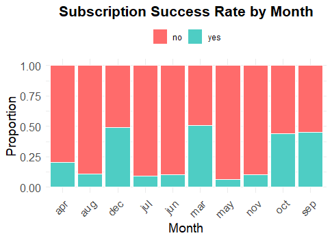

# Bank Marketing Campaign Visualization

## Overview
This project analyzes subscription patterns from a bank marketing campaign dataset. Using R and ggplot2, we created visualizations to explore how subscription success rates vary by the month of customer contact and by customer education level.

## Objective
- Identify seasonal patterns in customer subscription behavior.
- Understand the relationship between education level and likelihood of subscription.

## Tools Used
- R
- ggplot2
- dplyr

## Key Findings
- **Month of Contact:** Subscription success was highest in March, September, October, and December, suggesting these months were more effective for outreach.
- **Education Level:** Customers with higher education levels had slightly higher subscription rates compared to those with basic education, showing education may have a moderate influence on marketing success.

## Visualizations

### Subscription Success Rate by Month

---

### Subscription Success Rate by Education Level

---

## Files
- `bankmarketingVisual.R` — R script used to create the visualizations.
- `subscription_by_month.png` — Subscription success rate across months.
- `subscription_by_education.png` — Subscription success rate across education levels.

## How to Run
1. Install required R libraries: `ggplot2`, `dplyr`.
2. Load the `bankmarketingVisual.R` script into RStudio.
3. Ensure the dataset (`bank-additional-full.csv`) is available in your working directory.
4. Run the script to reproduce the visualizations.
